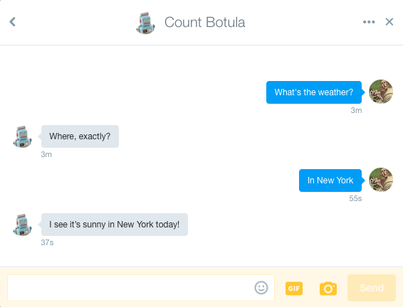

# Twitter DM example

This example demonstrates writing a bot using Twitter as an input / output mechanism.  It implements the same functionality as the [wit.ai quick start](https://wit.ai/docs/quickstart).

See [main.go](./main.go) for source code.

## Running

Create a file containing both wit.ai and Twitter API credentials, one per line.  The order must be:

    <Twitter consumer key>
    <Twitter consumer secret>
    <Twitter access token>
    <Twitter access token secret>
    <Wit.ai token>

Run the example with:

    ./scripts/run.sh 02-twitter -credentials=path/to/credentials

The account matching the Twitter access token will respond according to your configured wit.ai app.
